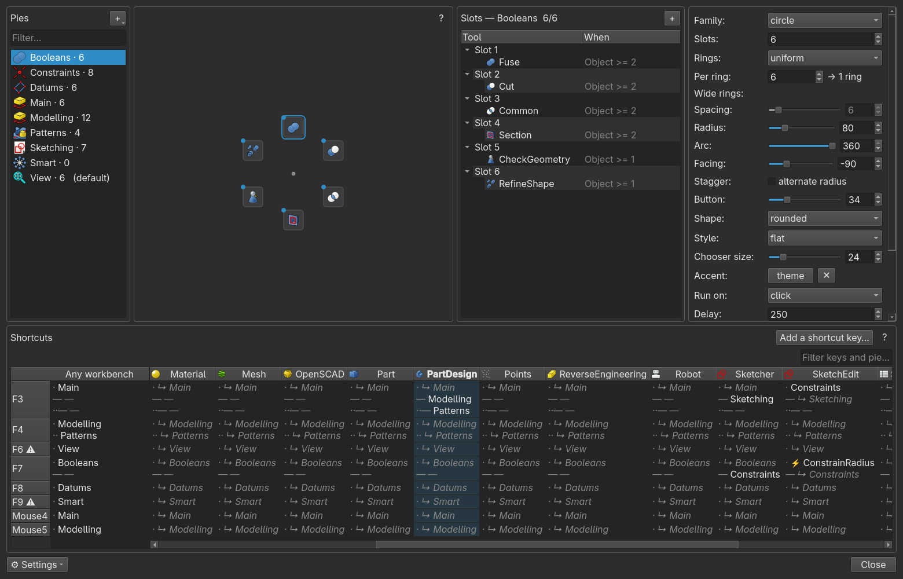
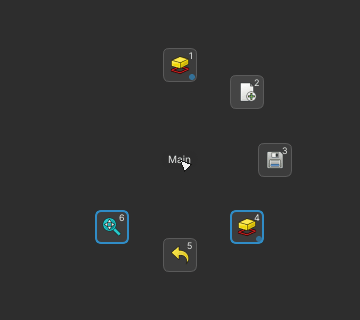
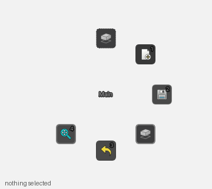
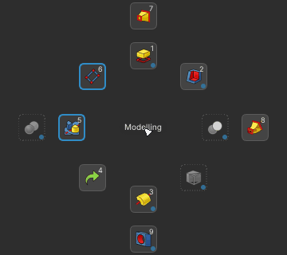
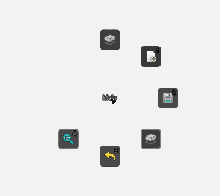
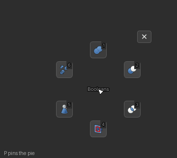
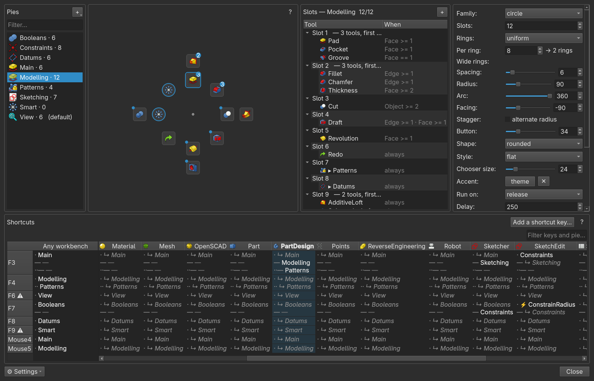
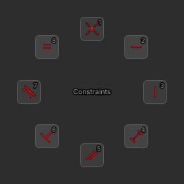
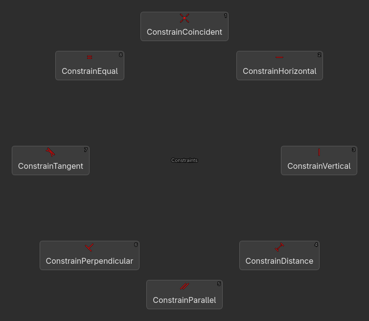
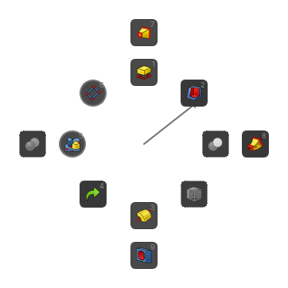

# PieMenu v2

> **Heads up:** this rewrite was first and foremost generated with AI, and
> so is this README. I use it daily and it works for me, but I haven't
> vetted the code too carefully. Back up your config before trying it.

Pie menus for FreeCAD. Press a key, flick toward a tool, let go. This is a
fork of [Grubuntu/PieMenu](https://github.com/Grubuntu/PieMenu) with the
internals redone from scratch.



## What's different from v1

* Shortcuts are per workbench. The same key can mean different pies in
  PartDesign and Sketcher, with an "Any workbench" binding as the fallback.
  Editing a sketch is its own scope (SketchEdit), falling back through
  Sketcher, so a key can do one thing in the sketcher and another while
  actually drawing.
* One key — or a spare mouse button (Mouse4/Mouse5) — can carry up to
  four pies: tap, double-tap, hold, and
  double-tap-then-hold. Hold gives you the marking-menu flow: the pie
  follows your aim with an arrow and firing happens on release. A quick
  tap on a hold binding does nothing instead of leaving a menu behind.
  A hold always behaves as a marking menu, whatever the pie's click
  behavior — and once the motion is in your hands, the menu itself is
  optional: a stroke completed before the pie even renders fires
  **blind** (mark-ahead), confirmed by a brief stroke trace, and a
  stroke that runs on through a door slot continues into that sub-pie
  as one compound mark. Pause instead, and the pie appears after a
  fifth of a second, anchored where you pressed — your movement already
  counts toward the aim. The aim is read as a direction (distance only
  picks the ring on multi-ring pies), the slot you're aiming at lights
  up, and the centre names what release will do — "Cancel" in the dead
  zone. Slots can also carry a one-letter shortcut that fires them
  while the pie is open.

  

  A gesture can also run a single command instead of a pie — tap for
  Constrain Radius, hold for the whole constraints pie ("A single
  command…" in the key's menu).
* Slots can have selection conditions (a face, two objects, an edge...).
  The same pie under different selections:

  

  When several tools match, a small chooser pops up under the slot, and it
  remembers which one you picked last.

  

* Slots can open other pies. Hovering one glides straight into it at the
  cursor, and a back button appears in the middle.

  
* Press P in an open pie to pin it as a floating palette: it stays on
  top, tools fire without closing it, conditional slots keep following
  your selection, and you drag it anywhere. Esc or the ✕ unpins. Dropped
  near a window edge it snaps flush and tucks away to a slim tab when
  the mouse leaves.

  
* There's a **Smart** pie that fills itself with your most-used tools for
  whatever workbench you're in. Counts decay over time so it tracks what
  you're doing now, not last month — but positions freeze after the
  first fill, because reshuffling is what kills muscle memory: tools are
  replaced in place, never moved (Stats… has the reset).
  Bind it to a key and forget about it.
  Right-click a tool in it to pin it so it never rotates out, or to
  ignore it entirely; your top tools land on the cardinal directions
  first, and what you use with a face selected leads when a face is
  selected.
* Layouts: circles with multiple rings (uniform, auto-fit by
  circumference, or custom counts like 8,16), or grids hanging off any
  side of the cursor with per-block offsets. Here's a two-ring pie and
  its slot rules in the editor:

  
* Plus: number keys 1-9 fire slots, Shift keeps the pie open so you can
  chain tools, right-click a slot in a live pie to edit it, macros as
  slot targets, per-part colors, single-pie export/import as JSON, a
  whole-setup export/import (every pie plus the keybinds, one file), new
  pie from any toolbar, a stats panel, the tool you fired last gets a
  faint accent ring, the shortcuts table warns (⚠) when a key would
  shadow one of FreeCAD's own, optional auto-open when your selection
  matches a conditional slot.

Icons come from FreeCAD's own command registry, so a pie full of Sketcher
tools looks right even if you've never opened Sketcher this session:



Command names can be shown under the buttons, and the layout spreads so
nothing overlaps:





## Install

```sh
git clone https://github.com/imadnyc/PieMenu ~/PieMenu
ln -s ~/PieMenu ~/.local/share/FreeCAD/v1-1/Mod/PieMenu
```

Restart FreeCAD. A fresh install starts with the full F3-F9 starter set
below, so the first press of F3 already works. An existing v1 PieMenu
config gets migrated automatically instead; the v1 data itself is left
alone. To merge the starter set into an existing config without touching
anything you already have:

```sh
freecadcmd ~/PieMenu/dev/install_seed.py
```

Preferences are under Tools > Accessories > PieMenu preferences.

## The starter keys

| Key | Anywhere | PartDesign | Sketcher |
|-----|----------|------------|----------|
| F3 tap | Main | | |
| F3 hold | | Modelling | Sketching |
| F3 double-hold | | Patterns | |
| F4 tap / double | Modelling / Patterns | | |
| F6 | View | | |
| F7 tap / hold | Booleans | | Constraints |
| F8 | Datums | | |
| F9 | Smart (your most used) | | |

These sit on F3-F9 because FreeCAD already uses F1 (help), F2 (rename)
and F5 (recompute). Bound keys are answered by PieMenu before FreeCAD
sees them — never while you're typing in a field — so if you rebind,
pick keys FreeCAD doesn't use.

## Keys while a pie is open

| Key | Does |
|-----|------|
| 1-9 | fire the numbered slot |
| Shift + pick | fire without closing, chain several tools |
| Backspace | back out of a sub-pie |
| P | pin the pie as a floating palette |
| Esc / ✕ | close a pinned palette |
| right-click a slot | edit it in the preferences |

The same list lives under **Keys…** in the preferences footer.

## Hacking on it

There's a Nix dev environment with FreeCAD 1.1.1 pinned. Everything runs
against a throwaway profile in /tmp, so your real config is never touched.

```sh
nix run .#launch   # isolated FreeCAD with this repo as the addon
nix run .#watch    # relaunch on save
nix run .#smoke    # headless test suite
nix run .#e2e      # end-to-end in a real offscreen GUI
nix run .#snap     # screenshot the widgets to /tmp/piemenu-snaps
```

FEATURES.md is the full feature inventory — every feature, where it
lives in the code, and how to remove it if it outgrows its welcome.
IMPLEMENTATION.md has the schema notes, UI-FEEDBACK.md the design
decisions, and mockups/ the HTML mockups the UI was designed in.

## Credits and license

Based on PieMenu by microelly (2015), looo, triplus, mdkus, Grubuntu,
Pgilfernandez, hasecilu and Ben-PH. LGPL-2.1-or-later, same as the
original.
